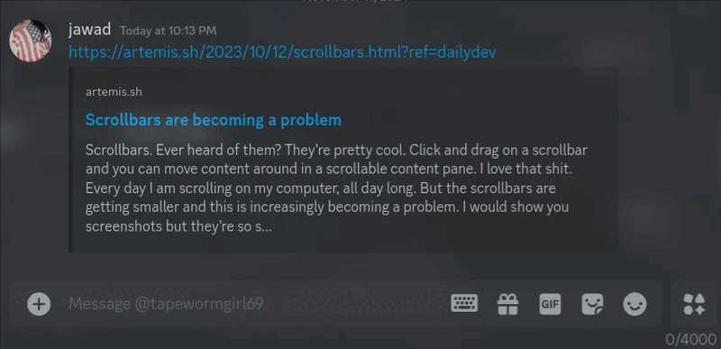

# LinkSummarizer

[](https://github.com/sf000000/discord-plugins)
[](https://opensource.org/licenses/MIT)

A BetterDiscord plugin that generates quick summaries of links using Ollama's local AI models. Right-click on any message containing a link to get a concise summary of the webpage content.



## Features

- 🔗 Summarize any webpage directly in Discord
- 🤖 Uses local AI models via Ollama
- ⚡ Fast and efficient processing
- ⚙️ Customizable settings

## Requirements

- [BetterDiscord](https://betterdiscord.app/)
- [Ollama](https://ollama.ai/) running locally or on a remote server
- At least one Ollama model installed (e.g., mistral:latest)
- Minimum system requirements:
  - 8GB RAM recommended
  - 2GB free disk space
  - CPU with AVX2 support (most CPUs from 2014 onwards)

## Installation

### 1. Install BetterDiscord

1. Download and install [BetterDiscord](https://betterdiscord.app/)
2. Download `LinkSummarizer.plugin.js`
3. Move it to your BetterDiscord plugins folder
4. Enable the plugin in BetterDiscord settings

### 2. Set Up Ollama

1. Install Ollama from [ollama.ai](https://ollama.ai/)

   - **Windows**: Download and run the installer
   - **macOS**: `curl -fsSL https://ollama.com/install.sh | sh`
   - **Linux**: `curl -fsSL https://ollama.com/install.sh | sh`

2. Install a model:

```bash
# Install the recommended model
ollama pull mistral:latest

# Or choose another model
ollama pull llama3
```

3. Start Ollama:

```bash
ollama serve
```

The API will be available at `http://localhost:11434`

## Usage

1. Right-click on any message containing a link
2. Click "Summarize Link" in the context menu
3. Wait a moment for the AI-generated summary

## Configuration

Access plugin settings through BetterDiscord settings panel:

- **Ollama Model**: Choose which model to use for summarization
- **Ollama Endpoint**: Configure your Ollama API endpoint
- **Max Content Length**: Adjust the maximum webpage content length to process
- **Summary Prompt**: Customize the prompt template for summaries

## Default Settings

```json
{
  "model": "mistral:latest",
  "endpoint": "http://localhost:11434/api/generate",
  "maxContentLength": 5000,
  "summaryPrompt": "Summarize this webpage content in 2-3 concise sentences..."
}
```

## Troubleshooting

1. **Plugin not working?**

   - Make sure Ollama is running (`ollama serve`)
   - Check if your model is installed (`ollama list`)
   - Verify the endpoint in plugin settings

2. **Summaries taking too long?**

   - Try a smaller model like `mistral:latest` or `llama2:7b`
   - Reduce the `maxContentLength` in settings

3. **API Connection Error?**
   - Ensure Ollama is running and accessible
   - Check if the endpoint matches your Ollama installation
   - Default endpoint is `http://localhost:11434`

## License

MIT License - feel free to modify and reuse!

## Credits

Created by [sf000000](https://github.com/sf000000)
